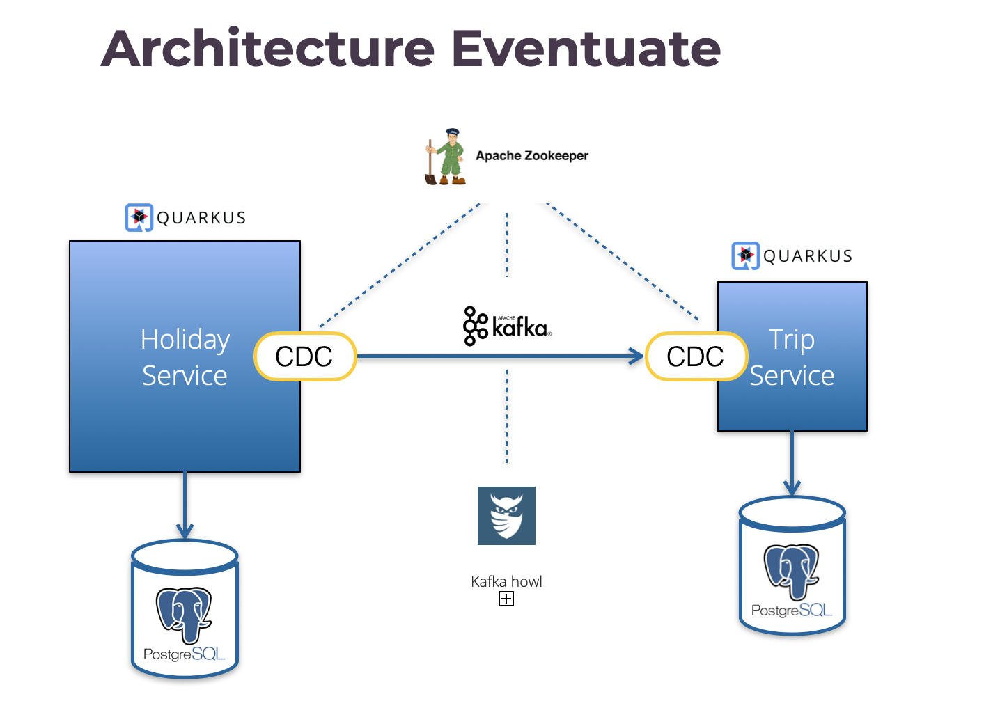
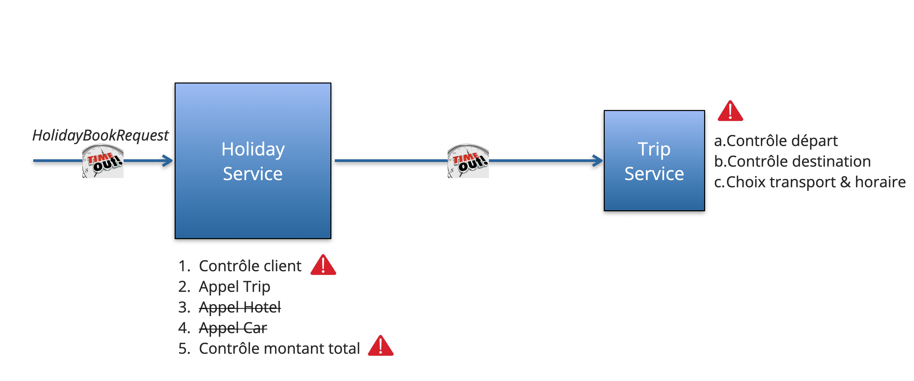
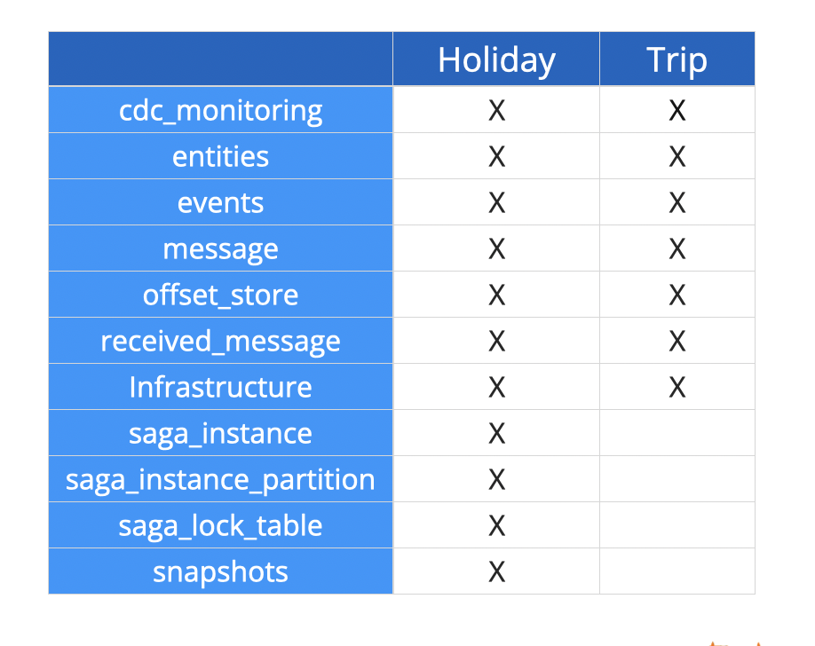
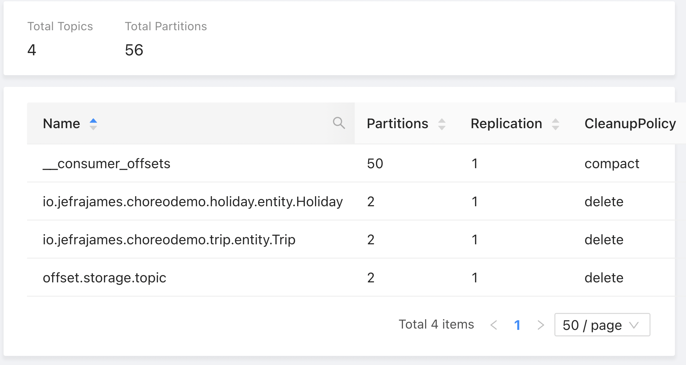

= Eventuate choreography demo

This project is based on https://eventuate.io/abouteventuatetram.html[Eventuate Tram], a microservice oriented open-source framework. It illustrates how to implement a choreography-based SAGA. https://microservices.io/patterns/data/saga.html[SAGA] offers a form of "distributed transactions" in a lightweight, loosely-coupled and generic way. 

With choreography, there is no central point of coordination telling all participants what to do. Instead the SAGA participants subscribe to each other's events and react accordingly. It is a form of implicit coordination.

Thr project is made of 4 modules:

. **holiday**: the edge service exposed to the outside. It invokes specialized backend services such as trip, hotel and car. In this version, only trip is implemented. Feel free to download the code and to complete it with the 2 other services. This will be a good exercice!
. **holiday-api-event**: defines the domain events produced by Holiday (and consumed by Trip)
. **trip**: a backend service invoked by Holiday
. **trip-api-event**: defines the domain events produced by Trip (and consumed by Holiday)

== Technical architecture

Comments:

. Both services are implemented with **Quarkus**
. They expose a REST API and uses CDI and JPA internally
. They communicate with asynchronous messaging
. Both services have their own *MySQL* database
. *CDC* stands for Change Data Capture. It is an Eventuate component that implements the  https://microservices.io/patterns/data/transactional-outbox.html[Transactional outbox pattern]. Eventuate messages (commands, replies, events) are written in a message table before being published on a Kafka topic. The CDC acts as message relay and ensures transactional messaging and duplication detection 
. *Kafka* is used as message broker
. *Howl* is a  https://github.com/redpanda-data/kowl[Kafka GUI] enabling to easily browse topics, messages, consumer groups
. *Zookeeper* supervises both Kafka and CDC. 

It is possible to run several CDC similar instances running in parallel (sharing the same EVENTUATELOCAL_CDC_LEADERSHIP_LOCK_PATH value), but only one is elected active by Zookeeper and able to read the message table.

=== About the domain events

SAGA offers a lightweight distributed transaction model on top of local ACID transactions. To that end, choreography-based SAGA uses domain events. A domain event is supposed to reflect a change in the system state.

Let's see how it works concretely in this example:

. when processing an incoming _HolidayBookRequest_, *holiday* first checks the customer id. If NOK, the book processing terminates on error. If OK, it publishes a _HolidayBookCreatedEvent_ and then interrupts the book processing waiting for *trip* to react
. when consuming such event, *trip* triggers its book business logic. If OK, it publishes a _TripBookedEvent_, otherwise a _BookTripFailedEvent_
. *holiday* consumes one of these events, and reacts accordingly:

* if _BookTripFailedEvent_, the book processing terminates on error,
* if _TripBookedEvent_, it keeps on the processing by checking the maximum amount. If max amount is exceeded *holiday* publishes a _HolidayBookFailedEvent_

. when consuming such event, *trip* cancels its previous ACCEPTED booking.

We can see from this example that this form of SAGA does not fit the need of complex use cases:

* the whole processing is spread among different domain event handlers, it lacks a central vision
* the coordination is based on domain events which can themselves evolve over time
* these drawbacks can lead to painfull debuging and maintenance.

  Orchestration-based SAGA is recommended for more complex use case. However, choreography has a clear advantage in terms of performance and remains a valid option on simple use cases. According to my tests choreography is twice faster than orchestration: 130 msec vs 240 msec. As always, software architecture is a matter of compromise ...

== Bridging synchronous and asynchronous execution

_HolidayBookRequest_ is received in a synchronous way on a REST endpoint (see __HolidayResource__). In contrast, the execution of the SAGA is asynchronous. 

For the demo, in order to display the complete response in Swagger-UI, it has been necessary to bridge the 2 modes of execution:

. The answer to _HolidayBookRequest_ is asynchronous using a _CompetionStage<Response>_ response code. It is completed afterwards when the execution of the SAGA is finished 
. The end of a SAGA is notified by a _HolidayBookSagaFinishedEvent_ domain event. This event is published by _HolidayBookSaga_ (see _onSagaCompletedSuccessfully_ and 
  _onSagaRolledBack_ methods) 
. This domain event is consumed by _HolidayEventConsumer_ to complete the pending JAX-RS Response
. _SagaToCompletableFuture_ stores the association of SAGAs instance and pending _CompletableFuture_ JAX-RS Responses.

== Technical context

As of this date (Feb 2023), the following technical context has been used:

. Java 17
. Quarkus 2.13.3.Final
. Eventuate Platform 2022.2.RELEASE

It has been developped on Linux. Some fixes may be required on MacOS or Windows. 
== Ports in use

There are several TCP ports used by this demo:

. Zookeeper: 2181
. Kafka: 9092,29092
. Kafka Howl: 9088
. MySQL-Holiday: 3306
. MySQL-Trip: 3308
. cdc-holiday: 9086
. cdc-trip: 9084
. Quarkus-Trip: 9082
. Quarkus-Holiday: 9080

== How to build

Run _mvn clean package_ in the main directory.

== How to start the demo

=== Start the infrastrucure

Zookeeper, Kafka, Kafka Howl, PostgreSQLs and CDCs are run with docker compose.

To start them:

. cd saga-infra
. ./start-infra.sh: previous containers and volumes are pruned to start with a fresh situation.

After the infrastructure has been started, you can check both CDCs to ensure that they are connected to the database and Kafka:

. cdc-holiday: http://localhost:9086/actuator/health
. cdc-trip: http://localhost:9084/actuator/health

CDCs can be configured in 2 modes to read the message table:

- SQL polling mode: this is a generic approach that can be used for all SQL databases, it is clearly not optimal in production
- by tailing the database server transaction log: available for MySQL and PostgreSQL. It is highly recommended to improve performance and scalability. This mode has been used for the demo.

=== Start Trip

. cd trip
. ./start-trip.sh

=== Start Holiday

. cd holiday
. ./start-holiday.sh

== Understanding the demo

Before running the demo, it is important to understand the processing in place:

Comments:

. *Holiday* acts as the edge service exposed to the outside. When receiving a HolidayBookResource, it starts a SAGA that orchestrates the processing
. It invokes *Trip* which checks the departure (accepted value: Paris) and the destination (accepted values: London, Dublin, Budapest, Barcelona), determines the transport (BOAT, TRAIN, PLANE) and the time schedule
. Invoking Hotel and Car is not yet implemented
. Holiday checks the total price that shouldn't exceed 500.00

 
The request is rejected if:

* customer id is NOK
* departure and destination are NOK
* total price exceeds the maximum value.

It is accepted if all checks are OK.

== Eventuate database

Eventuate needs some specific database tables to work with:

PS6PY can be used to discover how they are accessed behind the scene. You can activate it on Holiday by setting application.properties:
[source,properties]
----
quarkus.datasource.jdbc.driver=com.p6spy.engine.spy.P6SpyDriver
----
P6SPY is configured in src/main/ressources/spy.properties. SQL requests are written in spy-holiday.log.

Warning: P6SPY does not work with Quarkus in prod mode.

== How to run the demo

All the demo can be run from Holiday Swagger UI: http://localhost:9080/q/swagger-ui/

Kafka traffic can be checked from Kafka Howl: http://localhost:9088/topics

Trip Swagger UI can also be used to check the status of Trip entities: http://localhost:9082/q/swagger-ui/

=== Kafka topics

When the application is launched, several Kafka topics are created:

Comments:

* there is one topic per aggregate/entity class
* by default the topic name is the fully qualified name of the class

=== Demo 1: accepted request

From Holiday Swagger UI: 

. Chose HolidayResource POST "Book a Holiday with LRA"
. Select "Let's go to London" from the examples
. Try and execute it.

The response status should be ACCEPTED.

You can check the Kafka messages that have been exchanged between Holiday and Trip with Kafka Howl by digging in the  Topics. 
In particular, you can check that Trip reply (HolidayBookSaga topic) header reply_outcome-type is set to SUCCESS.

Check the consistency of the Trip entity:

. Get the trip_id value of the response in Holiday Swagger UI
. Go to Trip Swagger UI and select "find by id"
. The status should be ACCEPTED.

=== Demo 2: customer id NOK

From holiday Swagger UI:

. Change the customer id value to 4
. Execute it.

The request has been rejected by Holiday with a business error "Unknown customer".

=== Demo 3: destination NOK

From holiday Swagger UI:

. Reset the customer id value to 42
. Change the destination to "Londonx"
. Execute it.

The request has been rejected by Trip with a business error "Rejected destination Londonx".

Check the consistency of the Trip entity:

. Get the trip_id value of the response in Holiday Swagger UI
. Go to Trip Swagger UI and select "find by id"
. The status should be REJECTED

With Kafka Howl, you can check that Trip reply (HolidayBookSaga topic) header reply_outcome-type is set to FAILURE. This triggers a SAGA compensation. 

=== Demo 4: max price exceeded

From holiday Swagger UI:

. Reset the destination value to "London"
. Change the value of people_count to 2
. Execute it

The request has been rejected by Holiday with a business error "Max pricing exceeded".

Check the consistency of the Trip entity:

. Get the trip_id value of the response in Holiday Swagger UI
. Switch to Trip Swagger UI and select "find by id"
. The status should be CANCELED.

== Quarkus native mode

Building Holiday in native mode does not work yet. There is an error due to the use of java.util.Random.

